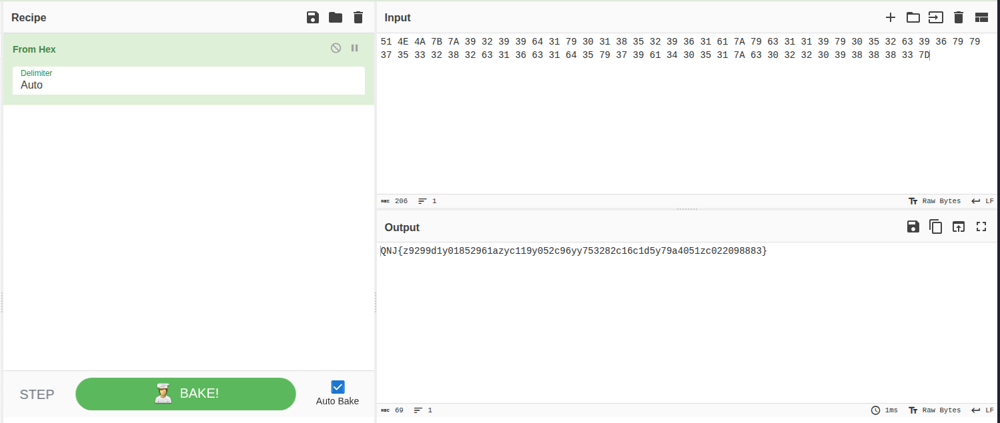
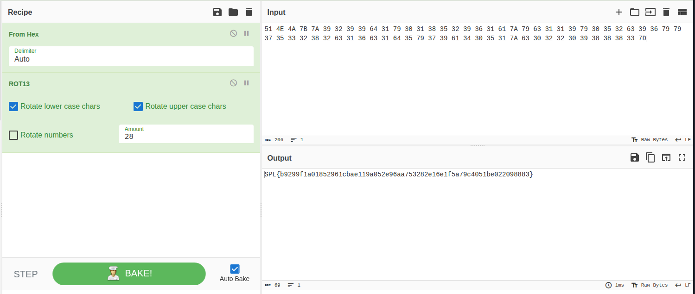

It seems to be hex values. 

I directly went to CyberChef.



```QNJ{z9299d1y01852961azyc119y052c96yy753282c16c1d5y79a4051zc022098883}```

then it seems to be ROT



```SPL{b9299f1a01852961cbae119a052e96aa753282e16e1f5a79c4051be022098883}```