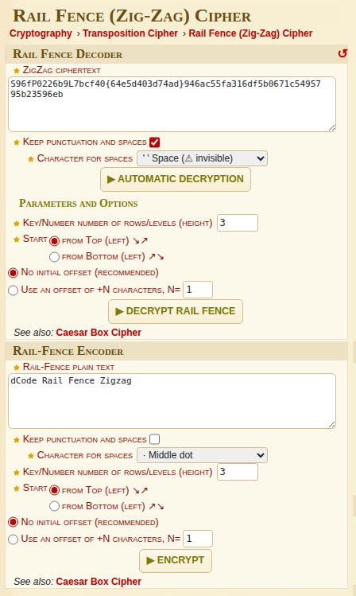
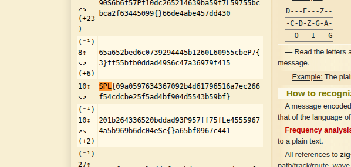

From the challenge name TrainEnc. 

The first and foremost scene that arrived in my mind after reading TrainEnc was a movie scene where Boman Irani was playing a role of police or detecting and they were trying to decode a message and he figured it out saying Patri Code. 

In proper manner once can even call it Rail Fence (Zig-Zag) Cipher

Going over to the dcode website - ```https://www.dcode.fr/rail-fence-cipher```



and just searching Ctrl+F and searching "SPL" got me the flag



```Flag - SPL{09a0597634367092b4d61796516a7ec266f54cdcbe25f5ad4bf904d5543b59bf}```