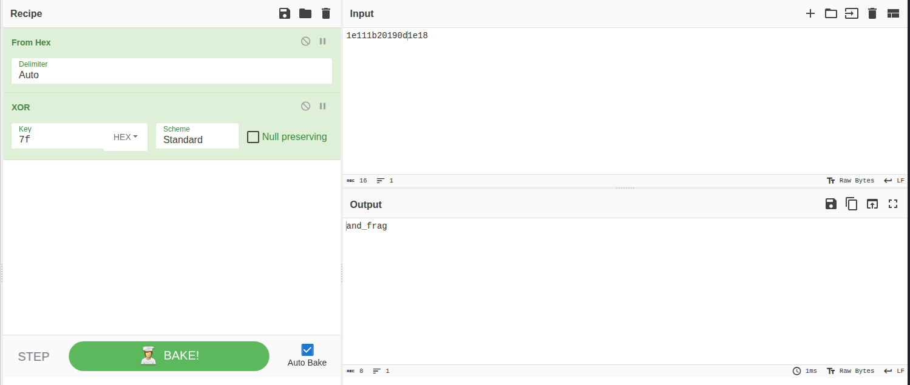

Unzipping the attachement, 
i got to more zips,

```
├── chal.zip
└── lanze.zip
```

unzipping both of them gave

```
┌──(sanskariwolf㉿sanskariwolf)-[~/…/HackornCTF 2025 Quals/Forensics/slxughter/slxughter]
└─$ unzip chal.zip 
Archive:  chal.zip
 extracting: part1.txt               
                                                                                                                    
┌──(sanskariwolf㉿sanskariwolf)-[~/…/HackornCTF 2025 Quals/Forensics/slxughter/slxughter]
└─$ unzip lanze.zip 
Archive:  lanze.zip
  inflating: part2a.txt              
```
checking what does those files contains

```
┌──(sanskariwolf㉿sanskariwolf)-[~/…/HackornCTF 2025 Quals/Forensics/slxughter/slxughter]
└─$ strings part1.txt 
SPL{brok3n_h3arts_
                                                                                                                    
┌──(sanskariwolf㉿sanskariwolf)-[~/…/HackornCTF 2025 Quals/Forensics/slxughter/slxughter]
└─$ strings part2a.txt 
                                                                                                                    
┌──(sanskariwolf㉿sanskariwolf)-[~/…/HackornCTF 2025 Quals/Forensics/slxughter/slxughter]
└─$ xxd part1.txt 
00000000: 5350 4c7b 6272 6f6b 336e 5f68 3361 7274  SPL{brok3n_h3art
00000010: 735f                                     s_
                                                                                                                    
┌──(sanskariwolf㉿sanskariwolf)-[~/…/HackornCTF 2025 Quals/Forensics/slxughter/slxughter]
└─$ xxd part2a.txt 
00000000: 1e11 1b20 190d 1e18                      ... ....
                                                                                                                    
┌──(sanskariwolf㉿sanskariwolf)-[~/…/HackornCTF 2025 Quals/Forensics/slxughter/slxughter]
└─$ 
```

part2a was XORed




```SPL{brok3n_h3arts_and_frag

but there is still isn't the closing braces

Then i did guess worked, i did feared of using guess as attempts were only limited to 3 so i did some command and tools run over the zip and txt files but after eventually getting no further clues and tips i process with the guesswork. 

```Flag - SPL{brok3n_h3arts_and_fragment}```

if fragment wouldn't have worked i would have tried fragments. and if that also failed then i would have raised tickets asking clarification over the challenge.