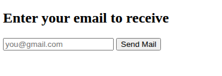
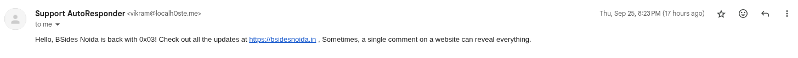
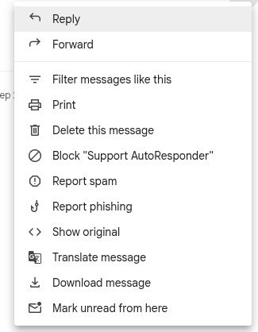
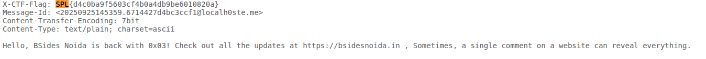

This was the instance 



Upon entering the my gmail i did recieved a mail



Checking over the original conent of the mail



scrolling though the content i found the flag, one can even just do Ctrl+F and search SPL to get the flag too.



```Flag - SPL{d4c0ba9f5603cf4b0a4db9be6010820a}```


Note - The first time I started solving this challenge, there were around 50 people who had solved this i guess at that time. and upon entering my mail it was not sending any, giving 403 errors so i though that the error is part of the challenge and there is some LFI or XSS or SSTL or SQLi. I wasted 30-60 minutes over that. Atleast if the challenge is down orgnizers should have provide a little bit of update over it;s status as soon as possible or compensation :).
Anyhow the challenge was cool P.P