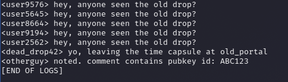
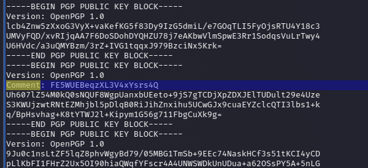
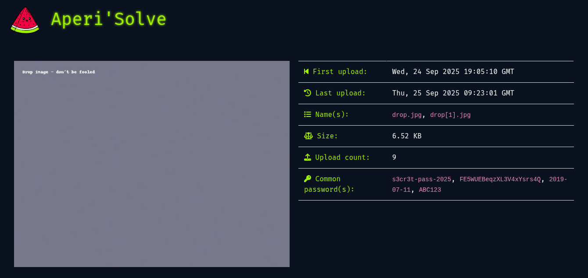
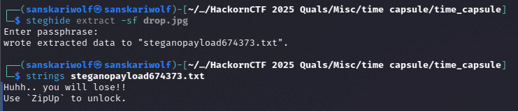
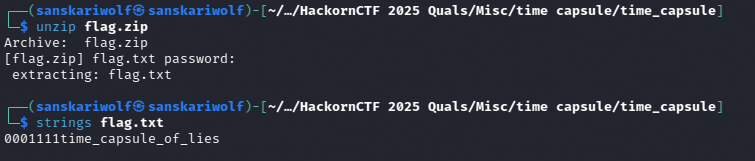

Unzipping the file gave me the following files
.
├── drop.jpg
├── flag.zip
├── forum_logs.txt
├── pubkeys.asc
└── users.csv


ran stegseek over drop.jpg, Got nothing. 

checked forum_logs.txt, found this as clue of hint towards something



```
<dead_drop42> yo, leaving the time capsule at old_portal
<otherguy> noted. comment contains pubkey id: ABC123
```

then i just checked pubkeys.asc, 
found just one key comment.



checked users.csv, and i was lost over proceeding.

though of checking keys with gpg but i though why not send the picture to aperisolve first to see ig bit planes got any clues, got nothing in bitplanes.

But aperisolve is strategically storing things. 



i thought of trying each one of these as password 
```s3cr3t-pass-2025, FE5WUEBeqzXL3V4xYsrs4Q, 2019-07-11, ABC123```
using steghide (I also used binwalk over the drop.jpg image but didn't find anything)

using ```s3cr3t-pass-2025``` as password did gave something



Using ```ZipUp``` as password to flag.zip did unzipped it.



flag.txt did gave the content of the flag ```0001111time_capsule_of_lies```

Flag - SPL{0001111time_capsule_of_lies}


I do feel a little bit wrong/sorry that it might not be the intended solution as I didn't used any of the files that were there to aid and aperisolve just gave off due to some other member's mistake. 