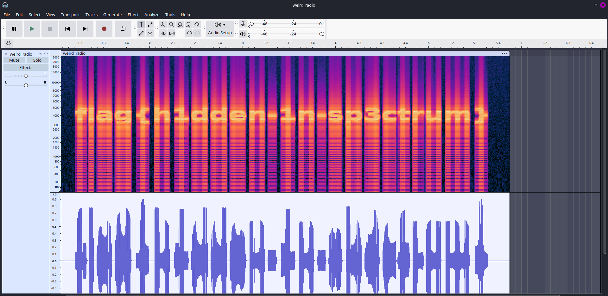

unzipping the file gave me weird_radio.wav file

the first thing to do with audio file is either to listen to it whethers it's morse code or not. 
One can also do if my check over the wave. 
I like to do to check wave first as it also gave the spectogram representation.
I used audacity. 



We can visible see the flag

```flag{h1dden-1n-sp3ctrum}```

Though it isn't matching the flag format

Thus
```Flag - SPL{h1dden-1n-sp3ctrum}```