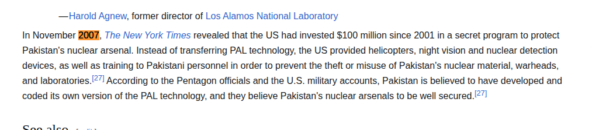
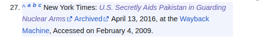
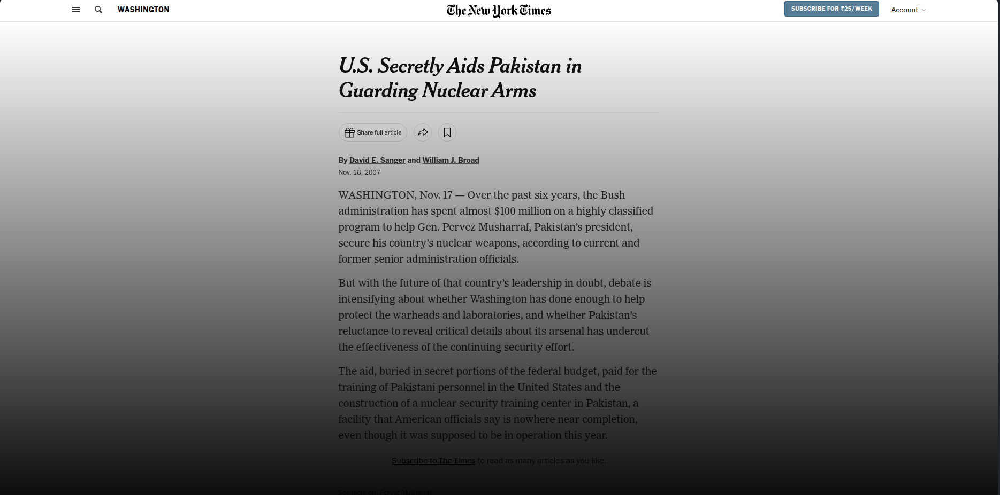
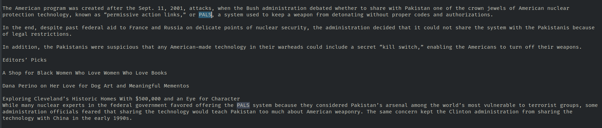

The key things that i understood from the description was ``` 2007, Permissive Action Links, memoir```

I came across many article but key articles that stood out were

https://www.armscontrolwonk.com/archive/201709/no-pals-for-paks/
https://en.wikipedia.org/wiki/Permissive_action_link

upon searching "2007" in the wifipedia article, i came across



and as we can see it is being referenced to 27 point.



the first link leads to NYT article
https://www.nytimes.com/2007/11/18/washington/18nuke.html

i guess organizer might not have seen but one has to get paid subcription to read it OR i just don't know if it might be published somewhere else



But u know what there was little lag in redacting the article and showing the subscription thing. 
I took benefit of that, as soon as the page load just copy the content to the clipboard before the article get redacted.

just paste it in the note pad or text editor which ever you use.

In the article it can be seen that the acronym is ```PALS```



Upon searching for the word memoir


```General Musharraf, in his memoir, “In the Line of Fire,” published last year, did not discuss any equipment, training or technology offered then, but wrote: “We were put under immense pressure by the United States regarding our nuclear and missile arsenal. The Americans’ concerns were based on two grounds. First, at this time they were not very sure of my job security, and they dreaded the possibility that an extremist successor government might get its hands on our strategic nuclear arsenal. Second, they doubted our ability to safeguard our assets.”```

memoir is “In the Line of Fire”

and i tried flags like SPL{PALS_In the Line of Fire} or SPL{PALS_In_the_Line_of_Fire} or SPL{PALS_IntheLineofFire}
and none of them were correct. 

then i just out of fluke, though that flag format is ```Flag: SPL{abcd_1234}```, why not replace the memoir with the year of publishing i.e. "last year" meaning 2006

and yeah that worked, i suppose there should be a little more specification in the description that the 2nd part is year of publishing of the memoir not just indentifying it

```Flag - SPL{PALS_2006}```