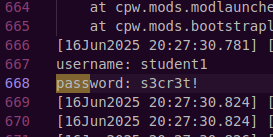

Unzipping the attachement gave server log для deepseek 2.txt

upon opening it was a very long file.
as in the challenge description there were references to credentials, just did Ctrl + F in the file and searched for "pass" 

and i found the credentials



```Flag - SPL{student1_s3cr3t!}```