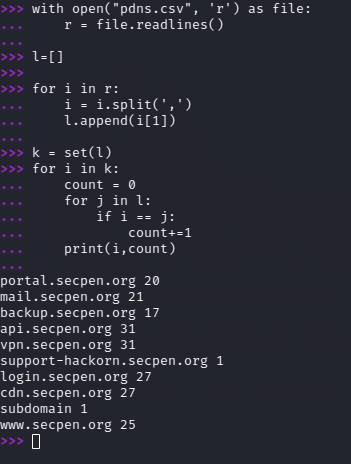

Unzipping the attachement gave me two files whois.txt and pdns.csv

whois provided us with the main domain ```secpen.org```

and pdns.csv provide with a list of subdomain that existed.


in the description of the challenge as it says brief;y existed that simple means for a short time or something. 
I merely tried counting the number times each sub domain occurs. 



```
portal.secpen.org 20
mail.secpen.org 21
backup.secpen.org 17
api.secpen.org 31
vpn.secpen.org 31
support-hackorn.secpen.org 1
login.secpen.org 27
cdn.secpen.org 27
subdomain 1
www.secpen.org 25
```

the subdomain which occurs the least number os time is itself ```support-hackorn.secpen.org```

and yeah that's the flag.

```Flag - support-hackorn.secpen.org```