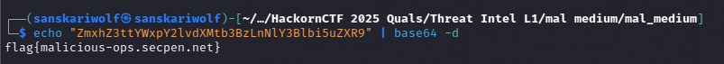

Unzipping the attachement provided me with the following files

```
├── network.log
├── pastebin.txt
├── strings.txt
└── vt_reports.json
```

tried surfing through the content of each file but they all where carryng a lot of text T_T

though pastebin.txt got some unusual length string in between


```
Paste 9:
ZmxhZ3ttYWxpY2lvdXMtb3BzLnNlY3Blbi5uZXR9
```

Seemed like base64 therefore tried it



flag format was again off

how so ever
```Flag - SPL{malicious-ops.secpen.net}```