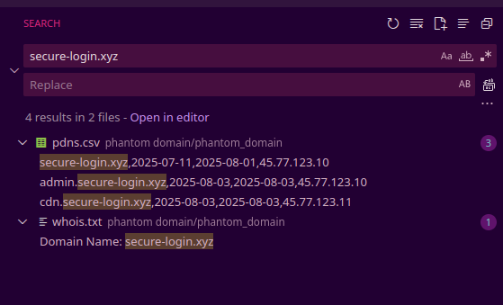

Unzipping the files gave me the following filed

```
├── auth.log
├── banners.jsonl
├── ctlog.json
├── pdns.csv
└── whois.txt
```

I started my hunt by searching with text ```secure-login.xyz``` as in the description



in whois.txt

i found that the domain is registed under a john.cyber@protonmail.com

```
Domain Name: secure-login.xyz
Registrar: NameCheap, Inc.
Registrant Email: john.cyber@protonmail.com
Creation Date: 2025-07-11
Expiration Date: 2026-07-11
Name Server: ns1.fakecdn.io
Name Server: ns2.fakecdn.io
```

AI comes into the play of analysis.

```
Initial Analysis

The investigation starts with the suspicious domain secure-login.xyz. The provided files contain various pieces of information that need to be correlated.

Passive DNS (pdns.csv):

secure-login.xyz resolves to the IP address 45.77.123.10.

Two subdomains, admin.secure-login.xyz and cdn.secure-login.xyz, are also present, resolving to 45.77.123.10 and 45.77.123.11 respectively. This confirms the attacker uses subdomains.

WHOIS Information (whois.txt):

The WHOIS record for secure-login.xyz reveals the registrant's email: john.cyber@protonmail.com.

The nameservers are listed as ns1.fakecdn.io and ns2.fakecdn.io.

Correlating the Data

The next step is to use the initial findings to uncover more of the attacker's infrastructure.

Pivoting on Nameservers:

A crucial piece of infrastructure is the set of nameservers. Searching the whois.txt file for other domains using ns1.fakecdn.io and ns2.fakecdn.io reveals another domain: ds.cloudhostserver.com. This links secure-login.xyz to ds.cloudhostserver.com.

Analyzing Certificate Transparency Logs (ctlog.json):

Certificate Transparency (CT) logs are public records of all issued SSL/TLS certificates. This is an excellent source for discovering subdomains, as a certificate must be issued for each one that uses HTTPS.

The ctlog.json file contains entries for cloudhostserver.com. Examining its contents reveals a certificate for panel-login.com with the following Subject Alternative Names (SAN):

panel-login.com

vpn.panel-login.com

internal-login.flagcorp.net

Identifying the Hidden Subdomain

The subdomain vpn.ds.cloudhostserver.com was a plausible lead based on recurring naming patterns, but the definitive evidence lies within the Certificate Transparency logs for panel-login.com, a domain also registered by john.cyber@protonmail.com and sharing infrastructure patterns. The ctlog.json file explicitly lists internal-login.flagcorp.net in the SAN field for a certificate issued to panel-login.com. This reveals a hidden domain that is not discoverable through passive DNS or simple WHOIS lookups.

Therefore, the hidden subdomain is the flag.

Flag: internal-login.flagcorp.net
```

And thus the final flag >.<

```Flag - SPL{internal-login.flagcorp.net}```