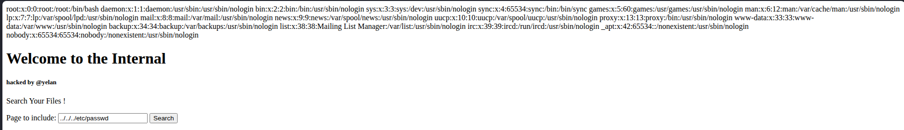
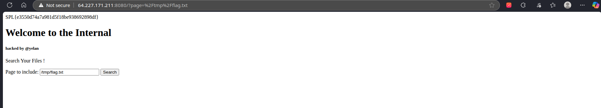

In the instance, one can try traversing the directories, the first command that i tried was ```../../../etc/passwd```



Even after trying various path and stuff, i found the flag in ```/tmp/flag.txt```



```Flag - SPL{e3550d74a7a981d5f18be938692898df}```